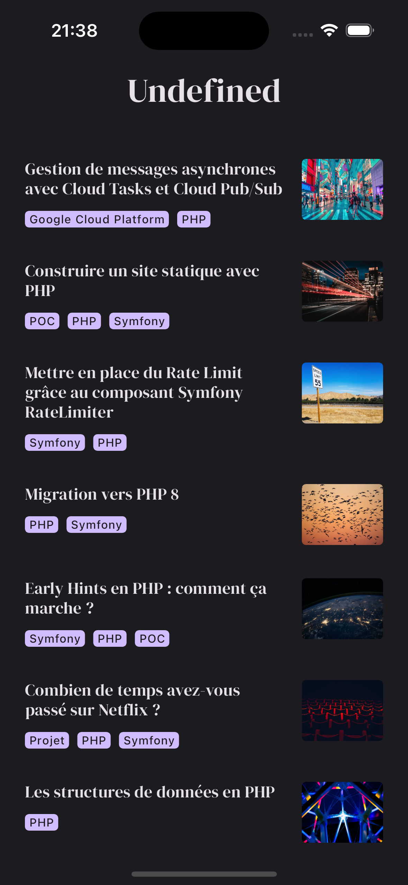

# Blog App

Flutter version of my blog https://www.udfn.fr

|  |  |
|-----------------------------------------------|-----------------------------------------------------|

## Installation

1. Install Flutter : https://docs.flutter.dev/get-started/install
2. Install dependencies: `flutter pub get`
3. Create `.env` with required ENV variables (see `.env.dist`)

